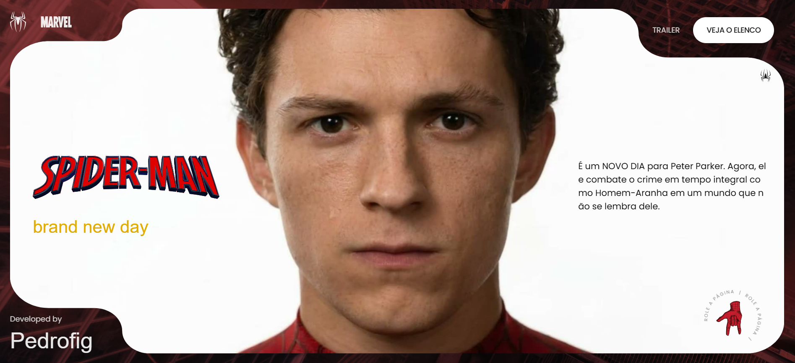
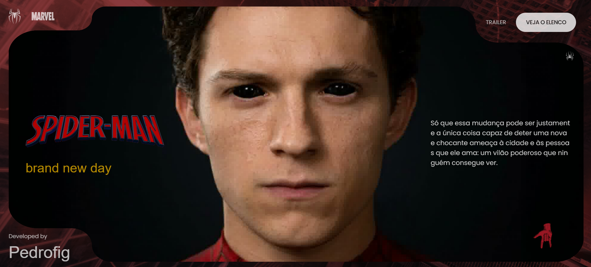
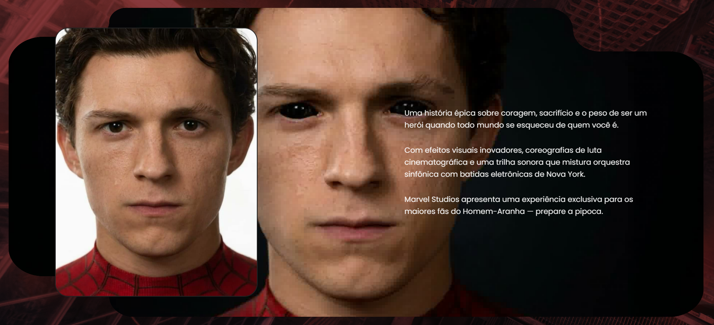
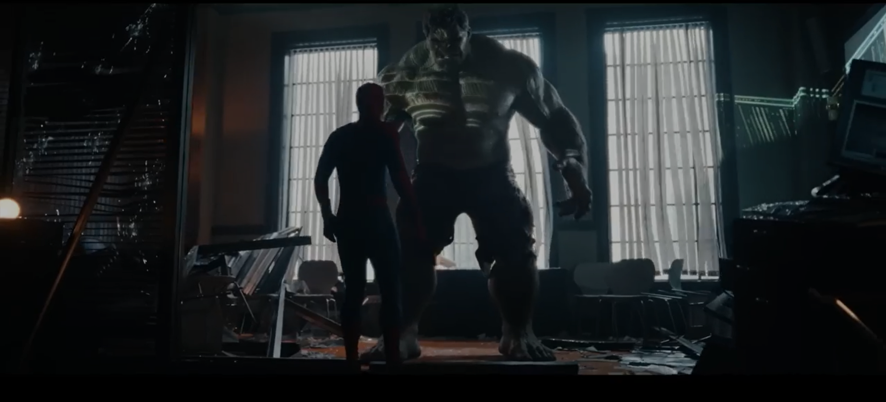
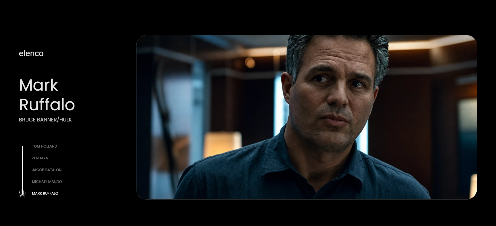

# 🕷️ Spider-Man: Brand New Day - Concept Website

**🔗 [View Live Project](https://brand-new-day-psi.vercel.app/)**

An immersive and interactive concept website for the Spider-Man universe, built with a focus on advanced scroll animations and a cinematic user experience.

## 📸 Screenshots

  
   
  
   
  
   
  
   
  

### 🚀 Project Highlights
* **GSAP Animations:** Extensive use of `ScrollTrigger`, `ScrollSmoother`, and `SplitText` to create fluid transitions that follow the user's scroll.
* **Canvas Hero Animation:** A frame-by-frame rendering drawn directly on a `<canvas>`, creating an incredible effect where the character interacts and transforms as you scroll down the page.
* **Custom Video Player:** A fully customized movie trailer player integrated into the website's aesthetic.
* **Interactive Cast Section:** A cast selector synchronized with page scrolling that reveals each actor and their character.
* **100% Responsive:** Carefully adapted layout to work perfectly on both mobile and desktop devices.

### 🛠️ Technologies Used
* **HTML5 & CSS3** (Custom styling and immersive typography)
* **JavaScript (Vanilla)**
* **GSAP (GreenSock Animation Platform)**

---

*Developed by Pedrofig.*
